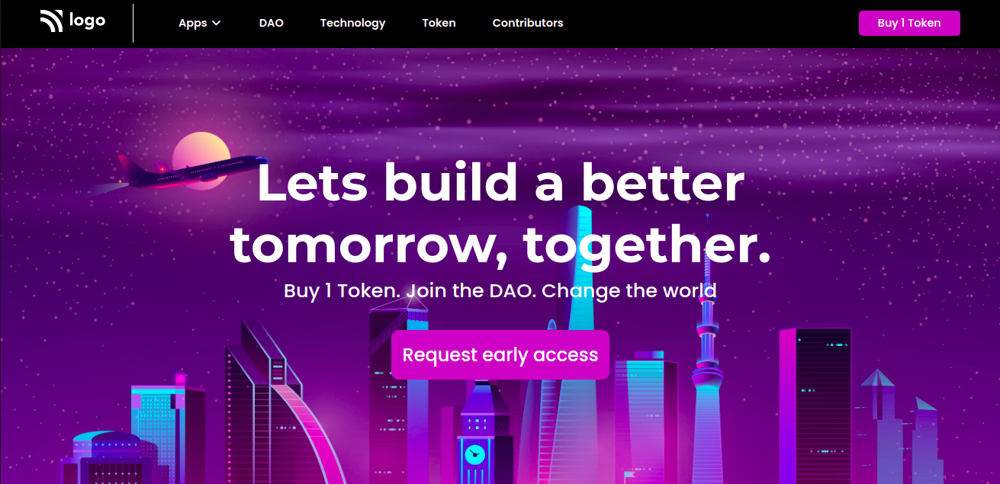

# Project-5

## Hey there, i am Yasir Lambawala

-

# Project-4:Buisness website

- This website is made with Html and CSS.It took me a while to adjust the background and the font sizes in this website.I learned a lot of little things by making this website.

- It took me 2hrs to make this website.The link of this project is attached below:

## 

## Screenshot

---

## 🛠 Skills learned

HTML, CSS

---

## 🚀 About Me

### Hey, I am Yasir lambawala

- I am born and brought up in Vadodara, Gujarat. I have done my Btech at GTU university and I am currently learning Web-development.

---

## Feedback

- If you have any feedback, please reach me at lambawalay@gmail.com
